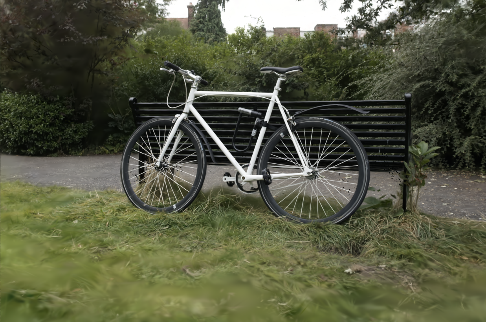
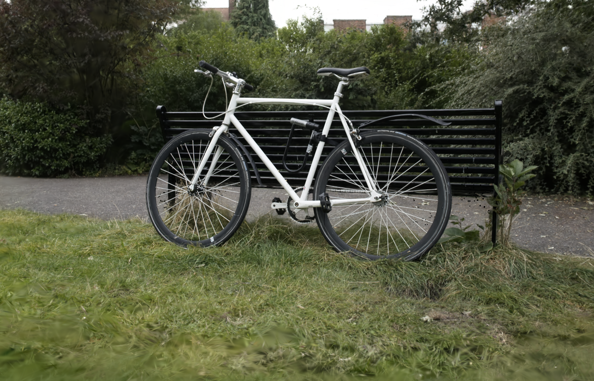

# gsplat by Silogen using ROCm

This Helm Chart deploys the gsplat workload. It uses a custom docker image. You can find its build steps at [Dockerfile](../../../docker/robotics/gsplat/Dockerfile).

## Prerequisites

Ensure the following prerequisites are met before deploying any workloads:

1. **Helm**: Install `helm`. Refer to the [Helm documentation](https://helm.sh/) for instructions.
2. **Kubectl** Install [kubectl](https://kubernetes.io/docs/tasks/tools/#kubectl).
3. Get access to a kubernetes cluster with AMD GPU nodes with ROCm support.

## Running the workload

It is recommended to use `helm template` and pipe the result to `kubectl apply` , rather than using `helm install`. Generally, a command looks as follows

```bash
helm template [optional-release-name] <helm-dir> -f <overrides/xyz.yaml> --set <name>=<value> | kubectl apply -f -
```

For example, to launch the workload in your default namespace, use the following command:

```bash
helm template testrun workloads/benchmark-robotics-gsplat/helm | kubectl apply -f -
```

## User input values

Refer to the `values.yaml` file for the user input values you can provide, along with instructions.

## Benchmarking results

To see the output of the benchmark run, e.g.:

```bash
kubectl logs -f benchmark-robotics-gsplat-testrun-f7vfv -c benchmark-robotics-gsplat
```
The summary table will be printed to the standard output in the end of the run. Note that your specific pod name used in the above command will be different. You can check it by reading the output of `kubectl get pods` command.

You can also check the rendering output in **/workloads/code/gsplat/examples/results/benchmark/[scene_name]/renders** and **/workloads/code/gsplat/examples/results/benchmark/[scene_name]/videos**. The following shows the rendering of the bicycle scene from the [Mip-NeRF 360 dataset](https://jonbarron.info/mipnerf360/) with different number of splats. The left image contains about 4M Gaussians, obtained after 7K training iterations of 3D Gaussian Splatting. The right image includes 8M Gaussians, corresponding to 30K training steps. As shown, a larger number of Gaussians enables much finer detail in the reconstruction.

<p float="left">
  
  
</p>
