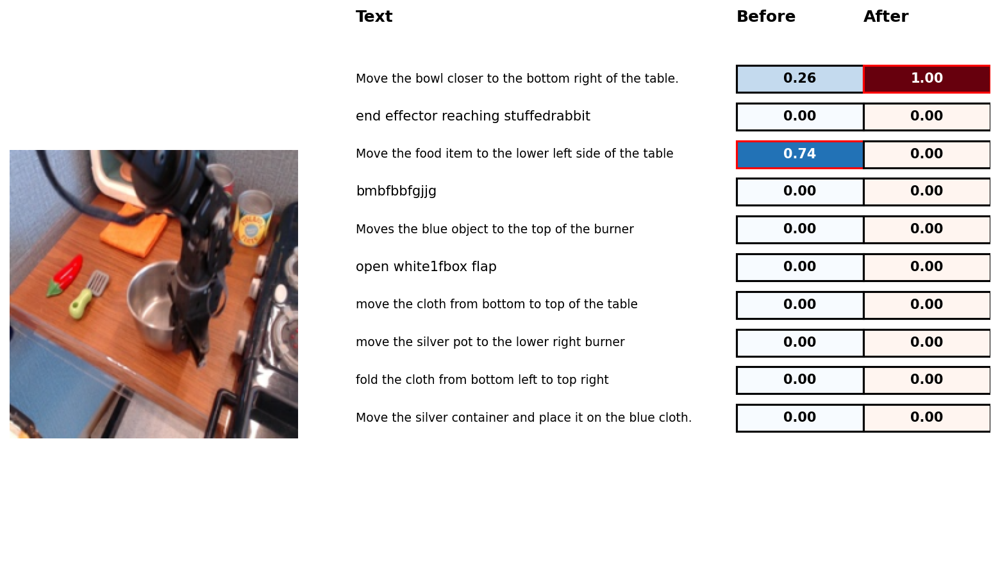

# VLM-LORA fine-tuning using OpenCLIP Workload

This workload showcases fine-tuning [Low-rank adaptation (LORA)](https://en.wikipedia.org/wiki/Fine-tuning_(deep_learning)#Low-rank_adaptation) layers for an OpenCLIP model. LORA layer fine-tuning is often much faster compared to full and makes sharing more space efficient.

Repo 'clipora' is used as a base with minor modifications: https://github.com/awilliamson10/clipora. clipora is an example of LORA fine-tuning from github user 'awilliamson10'. See files used to build the image in the [docker folder](/docker/vlm-lora-finetune).

## Links

- OpenCLIP repo: https://github.com/mlfoundations/open_clip
- CLIP fine-tuning guide (not LORA): https://github.com/mlfoundations/open_clip/discussions/812

## Steps

- Use an available OpenCLIP model (such as ViT-L-14) as a base with pretrained weights
- Inject new LORA layers to the base model
- Fine-tune just the LORA layers with new data, using Hugging Face's `peft`
- Save the fine-tuned LORA layers and use them later for inference with the base model. The save folder will contain
LORA config, (clipora) train config that was used and the LORA weights
- During inference, the pretrained model (including weights) is loaded again and the LORA layers injected with fine-tuned weights.

You can change some settings in clipora config, see [mount/bridge_train_config.yml](mount/bridge_train_config.yml) for example.

## Using custom data

You can use your own dataset for fine-tuning. Easiest way is to use a CSV file with a format OpenCLIP/clipora expects. It should have an image path and text as columns like this:

```
image_path,language_instruction
"/data/episode_0006/step_0037.png","put the cube on top of the cylinder"
"/data/episode_0048/step_0010.png","Move the blue spoon to the left burner"
"/data/episode_0046/step_0031.png","take the yellow cube and move in to the left"
...
```

Where each 'image_path' points to an image and each 'language_instruction' is a correct description of the image. There should be a train and evaluation CSV. When done, set `train_dataset` and `eval_dataset` to the CSV paths.

## Example run

`helm` folder contains a fully working example of fine-tuning on a Kubernetes cluster with an AMD GPU. It uses a subset of the BridgeData robotics dataset (https://github.com/rail-berkeley/bridge_data_v2) hosted on Hugging Face: https://huggingface.co/datasets/dusty-nv/bridge_orig_ep100. The bridge dataset contains multiple items of a robot's trajectory and the correct language instruction. In our case all trajectory images get a separate row and the language instruction is used as the correct text. The Hugging Face dataset is in TFRecords format and is parsed and modified to the CSV dataset format. NOTE: understanding the example dataset parsing script is not required, it's a one-off that's used to modify TFRecords to the OpenCLIP format of raw images and a CSV with image paths and texts. Example steps:

- download example bridge sample dataset and prepare it for OpenCLIP training with the format mentioned above.
- train LORAs with clipora on bridge sample dataset (note: training might take 15 minutes or more, logs do not instantly update)
- print probabilities and output an image visualizing results in PVC using the latest checkpoint

Workload should run successfully from start to finish with these commands:

```
# Create fine-tuning job and run it
helm template vlm-lora-openclip . --set metadata.user_id=username_here | kubectl apply -f -
```

You can check logs and status with these commands:

```
# get pod name. training job pod starts with 'vlm-lora-finetuning-job'
kubectl get pods
# check logs.
kubectl logs vlm-lora-finetuning-job-{user_id}-{pod_hash}
# by default the example job stays up for 10 minutes after finishing
# so if you want to you can copy the example output to your computer:
kubectl cp vlm-lora-finetuning-job-{user_id}-{pod_hash}:/workload/bridge_output bridge_output
```

Training started successfully if you see logs like this after 1-2 minutes:

```
...
INFO:root:Loaded ViT-L-14 model config.
INFO:root:Loading pretrained ViT-L-14 weights (datacomp_xl_s13b_b90k).
Starting clipora training with config: /mounted-files/bridge_train_config.yml

Output directory: /workload/bridge_output
Using seed 1337
***** Running training *****
  Using device: cuda
  Num Iters = 56
  Num Epochs = 3
  Instantaneous batch size per device = 32
  Gradient Accumulation steps = 1
```

It may take several minutes until the logs update. You might also see some warning messages about deprecated imports or missing cuda drivers which can be ignored.

### Example results

Comparing original and LORA models on evaluation set:

```
Running inference comparison...
Original eval loss:
{'eval_loss': tensor(4.7737)}
Lora eval loss:
{'eval_loss': tensor(0.4188)}
Visualizing results...
probs before:
[2.57515550e-01 1.46542358e-14 7.42484391e-01 3.23128511e-17
 5.35866707e-12 8.72237192e-25 6.95570677e-08 7.13214876e-10
 3.27358718e-13 1.16048234e-10]
probs after:
[9.9999988e-01 1.3494220e-27 1.3096904e-07 1.7481791e-22 4.6080438e-26
 3.9263898e-32 4.6212802e-19 5.2853294e-17 1.5104853e-20 2.8321767e-16]
```


*Highest probability in bold. First text is the correct one. As seen, after LORA layer training the result is correct. Note that this was picked randomly from evaluation set, in another case the fine-tuning might not have worked so well. Used for illustrative purposes.*
